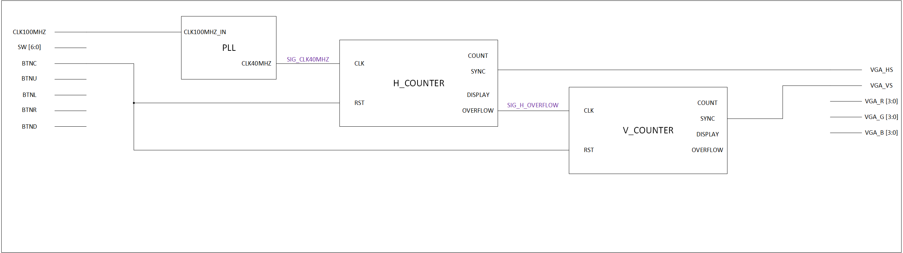

# VGA Image Rendering and Manipulation

## Členové týmu
- David Maňásek (generace obrazů, majitel repozitáře)
- Jan Kusák (vertikální/horizontální synchronizace)
- Lukáš Mackových (generace gradientů)

## Teoretický popis funkce
### Hodinový signál
Pro generaci hodinového signálu je použit vestavěný fázový závěs desky Nexis A7 50T a bloku IP pro jeho konfiguraci.

### Synchronizace
Pro úspěšné zobrazení obrazu je třeba generovat impulsy vertikální a horizontální synchronizace. Podle kmitočtu těchto pulsů pozná monitor námi požadované rozlišení a snímkovací kmitočet. Tyto impulsy jsou výstupy klopných obvodů jež se setují a resetují s určitou kombinací na verikálním a horizontálním čítači. Horizontání čítač čítá impulsy hodinového signálu a jeho hodnota odpovídá zobrazovanému sloupci, popř. nezobrazovyným částem front porch, back porch a synchronizační puls. Vertikální čítač určuje pozici řádku, popř stejných nezobrazovaných částí jako horizontální čítač.

### Generování obrazu
Obraz je z desky do monitoru přenesen pomocí analogových napěťových úrovní jednotlivých RGB složek. Ze schematu desky mužeme vyvodit že každá barva má bitovou hloubku 4 bity, jednoduchým výpočtem dostaneme $2^4 = 16$ odstínů jedné barvy, celkový počet je 4096 barev. Výsledné napětí je výsledkem odporové sčítačky napětí kde odpory ve větvích udávájí váhu jednotlivého bitu.

Generování 4bitových vektorů pro jednotlivé barvy jsou výsledkem kombinační a sekvenční logiky. Jako vstup této logiky jsou výstupy čítačů vertikální a horizontání synchronizace společně s hodinovými signály pro tyto čítače. Aktuálně zobrazovaný obraz lze měnit pomocí kombinace přepínačů na desce. 

## Schéma zapojení 
Vrstva top_level je zapojena dle přiloženého schématu níže. Skládá se z bloků PLL, elegatně řešící generaci 40MHz hodinového pulzu, na který je zapojen čítač horizontální osy monitoru. Stavy přetečení horizontálního čítače pak sleduje a vertikální čítač. Oba čítače lze snadno resetovat BTNC tlačítkem, jež je integrováno do desky. 

## Zdroje
https://electronics.stackexchange.com/questions/295130/vga-timing-sync-porch-positions-fpga

https://docs.github.com/en/get-started/writing-on-github/getting-started-with-writing-and-formatting-on-github/basic-writing-and-formatting-syntax

https://digilent.com/reference/_media/programmable-logic/nexys-a7/nexys-a7-d3-sch.pdf

https://digilent.com/reference/programmable-logic/nexys-a7/reference-manual