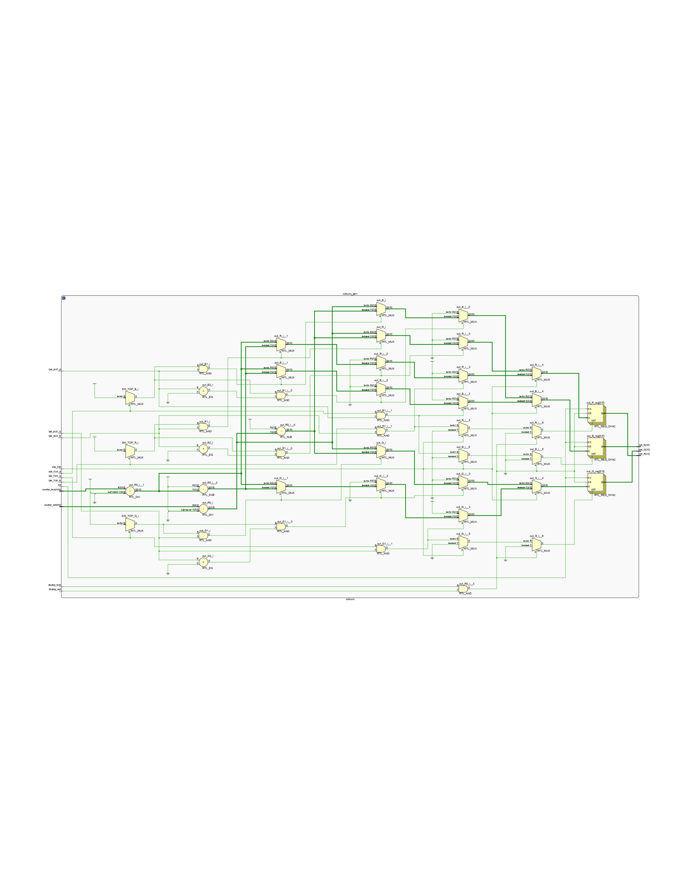

# VGA Image Rendering and Manipulation

## Členové týmu
- David Maňásek (generace tvarů)
- Jan Kusák (vertikální/horizontální synchronizace)
- Lukáš Mackových (generace barevných gradientů)

## Teoretický popis funkce
### Hodinový signál
Pro zjednodušení další práce je využito hodinového signálu o kmitočtu 40MHz. 

### Synchronizace
Standard SVGA jež byl zvolen pro tento projekt s rozlišením 800x600px a obnovovacím kmitočtem 60Hz popisuje přesné časování synchronizačních pulsů. Doba jednoho řádku je 26.4us, z toho viditelná část obrazu je prvních 20us, dále je 1us front porch, 3.2us dlouhý horizontální sync puls a 2.2us dlouhý back porch. Doba jednoho snímku je 16.579ms, z toho je 15.84ms viditelná část, 26.4us front forch, 105.6us vetrikální synchronizační impuls a 607.2us dlouhý back porch. Front a back porch jsou zde jen pro zpětnou kompatibilitu s CRT monitory kdy v tomto čase elektronový paprsek přebíhal zpět na začátek řádku.


### Přenos obrazu
VGA využívá pro vyjádření barev analogové úrovně napětí na linkách R,G a B, tyto linky jsou ukončeny zátěží 75Ω v monitoru. Tohle umožňuje realizaci jednoduchého D/A převodníku pomocí rezistorů jak je znázorněno na schematu níže.  


# Popis hardwerového zapojení
## Schéma zapojení 
Vrstva top_level je zapojena dle přiloženého schématu níže. Skládá se z bloků PLL, elegatně řešící generaci 40MHz hodinového pulzu, na který je zapojen čítač horizontální osy monitoru. Stavy přetečení horizontálního čítače pak sleduje a vertikální čítač. Oba čítače lze snadno resetovat BTNC tlačítkem, jež je integrováno do desky. 

*Schéma zapojení vrstvy top_level*

## Hodinový signál
Pro generaci hodinového signálu je použit vestavěný fázový závěs desky Nexis A7 50T a bloku IP pro jeho konfiguraci.

## Synchronizace
Pro úspěšné zobrazení obrazu je třeba generovat impulsy vertikální a horizontální synchronizace. Podle kmitočtu těchto pulsů pozná monitor námi požadované rozlišení a snímkovací kmitočet. Tyto impulsy jsou výstupy klopných obvodů jež se setují a resetují s určitou kombinací na verikálním a horizontálním čítači. Horizontání čítač čítá impulsy hodinového signálu a jeho hodnota odpovídá zobrazovanému sloupci, popř. nezobrazovyným částem front porch, back porch a synchronizační puls. Vertikální čítač určuje pozici řádku, popř stejných nezobrazovaných částí jako horizontální čítač.

## Čítač
Blok ,,counter.vhd" je univerzálně navržen pro čítání horizontálních či vertikálních pixelů. Na vstup přivádíme hodinový pulz a resetovací tlačítko. Výstupní signály jsou pak:
-	,,sync“  = synchronizační pulz obrazovky (active LOW), 
-	,,display“ = pulz definující, zda se čítač nachází ve viditelné části obrazovky (active HIGH),
-	,,overflow“ = je v HIGH úrovni, pokud čítač přetekl.

Interní konstanty čítače josu pak řešeny generiky, čímž se rozumí standardizované numerické hodnoty spouštění uvedené v [1]. 

Proces čítače reaguje na nástupnou hranu přiváděného hodinového pulzu, čímž pro horizontální čítač je výstup z PLL. Vertikální čítač spouštíme výstupním impulzem indikující přetečení horizontálního čítače. 

Oba čítače jsou napojeny na stejný reset.


*Schéma zapojení čítače*

## Generace obrazu
Ze schematu desky mužeme vyvodit že každá barva má bitovou hloubku 4 bity, jednoduchým výpočtem dostaneme $2^4 = 16$ odstínů jedné barvy, celkový počet je 4096 barev. Výsledné napětí je výsledkem odporové sčítačky napětí kde odpory ve větvích udávájí váhu jednotlivého bitu.

Generování 4bitových vektorů pro jednotlivé barvy jsou výsledkem kombinační a sekvenční logiky. Jako vstup této logiky jsou výstupy čítačů vertikální a horizontání synchronizace společně s hodinovými signály pro tyto čítače. Aktuálně zobrazovaný obraz lze měnit pomocí kombinace přepínačů na desce.

## Zobrazení tvarů
Pro zobrazení zvoleného tvaru na pozadí je signál barevného pozadí potlačen a místo něj vložen signál odpovídající barvě tvaru. Pokud se aktuální pozice nachází mimo tvar, je pozadí předáno dále skrze bloky shapes a square nebo triangle.

Pohyb tvarů zajišťují 4 tlačítka. Podle těchto vstupních signálů je poté každý snímek inkrementována nebo dekrementována příslušná hodnota vertikálního nebo horizontálního posunu (offsetu).

O samotnou tvorbu tvarů se starají bloky square a triangle, jež podle aktuální pozice řádku a sloupce matematicky odvodí, zda zobrazit zvolený tvar s předem nastavenou barvou nebo propustiti signál pozadí na výstup.


*Schéma zapojení bloku square*


*Schéma zapojení bloku triangle*


## Generování pozadí
Gradient na pozadí je vytvořen z poloh šesti fyzických přepínačů na desce FPGA. První tři přepínače volí RGB barvu nahoře obrazovky, druhé tři naspodu obrazovky, poslední spínač vybírá mezi vertikálním a horizontálním gradientem. Při generaci se tvoží každá barva zvlášť a složí se až vizuálně na monitoru.

Pokud jsou přepínače jedné barvy nastaveny shodně, zobrazí se jednolitá barva. Pokud chceme gradient, musí být přepínače nastaveny rozdílně, konkrétní polohy rozhodnou o překlopení gradientu.
Díky pevně nastavené velikosti obrazovky 800x600 a znalosti počtu zobrazitelných barev můžeme rozdělit obrazovku na 16 segmentů. Vertikálně budou segmenty 38.5 pixelů vysoké, což zaokrouhlíme na 39, a horizontálně 50 pixelů široké. Při generaci gradientů, využijeme  velikost segmentů  k dělení aktuální hodnoty signálu příslušného čítače udávajícího polohu v řádku nebo sloupci. Dělení vrací 4-bitovou hodnotu udávající hodnotu jedné barvy pro příslušný pixel, dle nastavených přepínačů. 


*Schéma zapojení bloku colours*

# Detail VHDL kódu

## Counter segment
Příklad definice interních genericů pro horizontální čítač
```
generic (
    nbit         : integer := 11;       -- Počet bitů čítače
    length       : integer := 1056;     -- Kapacita čítače  
    front_porch  : integer := 40;       -- Délka front porch v px
    sync_pulse   : integer := 128;      -- Délka synchronizačního pulzu v px
    back_porch   : integer := 88;       -- Délka back porch v px
    visible_area : integer := 800       -- Délka obrazovky v px
  );
```

Příklad definice portů horizontálního čítače
```
port (
    clk      : in    std_logic;                                 -- Taktování
    rst      : in    std_logic;                                 -- Reset
    count    : out   std_logic_vector(nbit - 1 downto 0);       -- Aktuální numerický stav čítače
    sync     : out   std_logic;                                 -- Synchronizační pulz (Active Low)
    display  : out   std_logic;                                 -- Ukazuje, zda je čítač ve viditelné části monitoru (Active High)
    overflow : out   std_logic                                  -- Aktivní, pokud došlo k přetečení čítače
  );
  ```

## Colours segment
```
counter_horz         : in std_logic_vector (10 downto 0);
counter_vert         : in std_logic_vector (9 downto 0);
```
Definice vstupů čítačů pro horizontální a vertikální řady

```
constant coloursCount           : unsigned(3 downto 0) := "1111";		--Maximum barev
constant vertSegmentCount       : unsigned(5 downto 0) := "100110";		--Počet vertikálních segmentů
constant horzSegmentCount       : unsigned(5 downto 0) := "110010";		--Počet horizontálních segmentů
```
Definice konstant

```
out_R <= std_logic_vector(resize((unsigned(counter_vert) / vertSegmentCount),out_R'length));
```
Signál z čítače je prvně převeden na unsigned, poté je vydělen počtem segmentů a pomocí resize je zkrácen na 4 bity. Výsledek je převeden na logický vektor.
```
out_R <= std_logic_vector(resize(coloursCount - (unsigned(counter_vert) / vertSegmentCount),out_R'length));
```
Operace je obdobná s předchozí pouze je výsledek dělení odečten od maxima barev pro inverzi směru gradientu.

## Square segment

```
v_nbit: integer := 10;
h_nbit: integer := 11;
size: integer := 250;
-- default color is white
R: integer := 15;
G: integer := 15;
B: integer := 15
```
Velikost a barva čtverce mužou být nastaveny pomocí generic.


```
(unsigned(rowNum) >= unsigned(rowOffset)) and (unsigned(rowNum) < (unsigned(rowOffset) + size))
```
Podmínka pro stanovení, zda číslo řádku zasahuje do tvaru čtverce.

```
(unsigned(colNum) > unsigned(colOffset)) and (unsigned(colNum) < (unsigned(colOffset) + size))
```
Podmínka pro stanovení, zda číslo sloupce zasahuje do tvaru čtverce.

```
if (rowInRange = '1' and colInRange = '1') then
    colorRout <= std_logic_vector(to_unsigned(R, colorRout'length));
    colorGout <= std_logic_vector(to_unsigned(G, colorGout'length));
    colorBout <= std_logic_vector(to_unsigned(B, colorBout'length));
else
    -- pass background through
    colorRout <= colorRin;
    colorGout <= colorGin;
    colorBout <= colorBin;
end if;
```
Pokud jsou obě podmínky vyhodnoceny jako pravdivé je na výstupní porty barev přiřazena barva čtverce, v opačném případě projde barva pozadí nezměněna. 

## Triangle segment
Jako u segmentu Square, lze i zde nastavit barvu a velikost pomocí generic.

```
triangle_width <= (unsigned(rowNum) - unsigned(rowOffset))/2;
```
Jedná se o rovnoramenný trojuhelník. Z pozice řádku a posunu tvaru ve vertikální ose je spočítána šířka trojúhelníku na aktuálním řádku.

```
(unsigned(colNum) > (unsigned(colOffset) + to_unsigned(size, h_nbit)/2 - triangle_width )) and
(unsigned(colNum) < (unsigned(colOffset) + to_unsigned(size, h_nbit)/2 + triangle_width))
```
Šířka trojuhelníku je poté využita v podmínce pro aktuální číslo sloupce.

Podmínka pro řádek a následné přiřazení barev na výstupy je stejná jako u segmentu Square

## Instrukce
Ovládání probíhá pomocí pěti tlačítek a devíti přepínačů na desce FPGA. 
- BTNC - Reset
- BTNU - Posun obrazce nahoru
- BTND - Posun obrazce dolů
- BTNR - Posun obrazce doprava
- BTNL - Posun obrazce left
- SW0 - Červená nahoře
- SW1 - Zelená nahoře
- SW2 - Modrá nahoře
- SW3 - Červená dole
- SW4 - Zelená dole
- SW5 - Modrá dole
- SW6 - Směr gradientu
- SW14 - Zobrazení čtverce
- SW15 - Zobrazení trojúhelníku

[](https://www.youtube.com/watch?v=8O0zno7WMLM)

## Zdroje
[1] http://tinyvga.com/vga-timing/800x600@60Hz

[2] https://electronics.stackexchange.com/questions/295130/vga-timing-sync-porch-positions-fpga

[3] https://docs.github.com/en/get-started/writing-on-github/getting-started-with-writing-and-formatting-on-github/basic-writing-and-formatting-syntax

[4] https://digilent.com/reference/_media/programmable-logic/nexys-a7/nexys-a7-d3-sch.pdf

[5] https://digilent.com/reference/programmable-logic/nexys-a7/reference-manual
