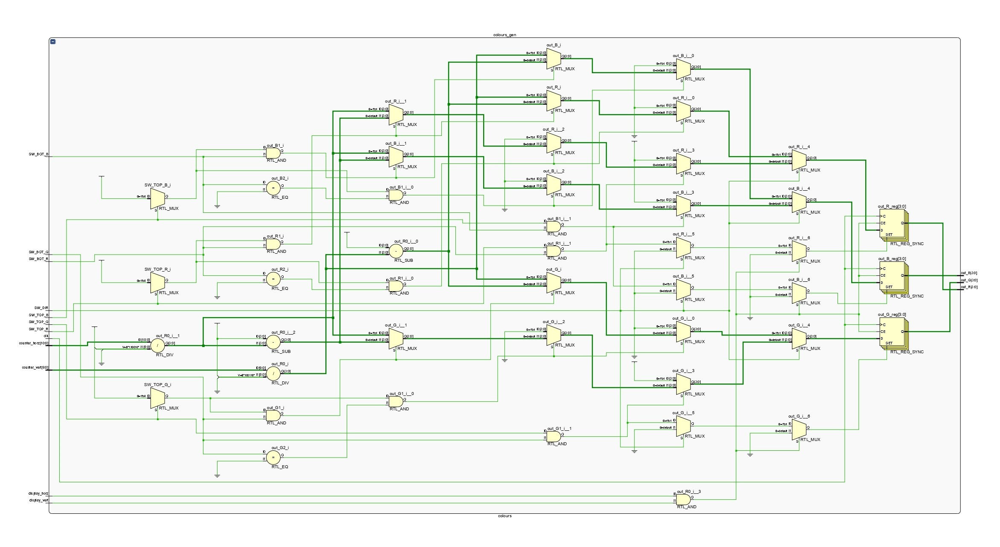

# VGA Image Rendering and Manipulation

## Team membeers
- David Maňásek (Shape generation)
- Jan Kusák (vertical/horizontal generation)
- Lukáš Mackových (color gradient generation)

## Theoretical description
### Clock signal
For simplification of future work a clock signal of 40 MHz is used.

### Synchronization
Standard SVGA chosen for this project with a resolution of 800x600px and a refresh rate of 60Hz describes precise timing of synchronization pulses. The duration of one line is 26.4us, with the visible part of the image being the first 20 us, followed by a 1us front porch, a 3.2 us long horizontal sync pulse, and a 2.2 us long back porch. The duration of one frame is 16.579 ms, with 15.84 ms being the visible part, 26.4us front porch, 105.6 us vertical synchronization pulse, and 607.2 us long back porch. Front and back porches are included here for backward compatibility with CRT monitors, during which the electron beam was transitioning back to the beginning of the line.


### Picture transfer
VGA utilizes analog voltage levels on the R, G, and B lines to express colors, with these lines terminated by a 75 Ω load in the monitor. This enables the implementation of a simple D/A converter using resistors, as illustrated in the schematic below.

 


# Hardware description
## Schematics

The top_level layer is connected according to the schematic provided below. It consists of PLL blocks, elegantly addressing the generation of a 40MHz clock pulse, which is connected to the horizontal axis counter of the monitor. The overflow states of the horizontal counter are then monitored by the vertical counter. Both counters can be easily reset by the BTNC button integrated into the board.


*Schematic of top_level layer*

## Clock signal
For clock signal generation, the built-in phase-locked loop (PLL) of the Nexis A7 50T board is utilized along with an IP block for its configuration.

## Synchronization
For successful image display, it is necessary to generate vertical and horizontal synchronization pulses. Based on the frequency of these pulses, the monitor recognizes our desired resolution and refresh rate. These pulses are outputs of flip-flops that are set and reset with specific combinations on the vertical and horizontal counters. The horizontal counter counts clock signal pulses, and its value corresponds to the displayed column, or alternatively to the non-displayed parts such as front porch, back porch, and synchronization pulse. The vertical counter determines the row position, or similarly the non-displayed parts like the horizontal counter.

## Counter
The "counter.vhd" block is universally designed for counting horizontal or vertical pixels. Clock pulse and reset button are input to it. The output signals are then:

- "sync" = screen synchronization pulse (active LOW),
- "display" = pulse defining whether the counter is in the visible part of the screen (active HIGH),
- "overflow" = is in a HIGH state if the counter has overflowed.

Internal constants of the counter are then addressed by generics, which means standardized numerical values specified in [1].

The counter process responds to the rising edge of the incoming clock pulse, which for the horizontal counter is the output from the PLL. The vertical counter is triggered by an output pulse indicating the overflow of the horizontal counter.

Both counters are connected to the same reset.


*Counter schematic*

## Picture generation
From the board schematic, we can deduce that each color has a bit depth of 4 bits. By a simple calculation, we get $2^4 = 16$ shades of one color, resulting in a total of 4096 colors. The resulting voltage is the outcome of a resistive voltage adder, where the resistors in the branches determine the weight of each bit.

Generating 4-bit vectors for individual colors is the result of combinational and sequential logic. The inputs to this logic are the outputs of the vertical and horizontal synchronization counters together with clock signals for these counters. The currently displayed image can be changed using a combination of switches on the board.

## Shape Display
To display the selected shape on the background, the signal of the background color is suppressed, and instead, a signal corresponding to the shape color is inserted. If the current position is outside the shape, the background is passed through the shapes and square or triangle blocks.

The movement of shapes is controlled by 4 buttons. Based on these input signals, each frame is then incremented or decremented by the corresponding vertical or horizontal offset value.

The creation of shapes is handled by square and triangle blocks, which mathematically derive whether to display the selected shape with a preset color or pass the background signal to the output based on the current row and column position.


*Schematic of square layer*


*Schematic of triangle layer*


## Background generation
The background gradient is created from the positions of six physical switches on the FPGA board. The first three switches select the RGB color at the top of the screen, the second three at the bottom of the screen, and the last switch selects between vertical and horizontal gradient. Each color is generated separately and visually composed on the monitor.

If the switches of one color are set identically, a solid color is displayed. To create a gradient, the switches must be set differently, and specific positions determine the direction of the gradient.
Due to the fixed screen size of 800x600 and knowledge of the number of displayable colors, we can divide the screen into 16 segments. Vertically, the segments will be 38.5 pixels high, rounded to 39, and horizontally 50 pixels wide. When generating gradients, we use the segment size to divide the current value of the signal of the corresponding counter indicating the position in the row or column. Division returns a 4-bit value indicating the color value for the respective pixel, according to the settings of the switches.


*Schmatic of coulours layer*

# Detail of VHDL codee

## Counter segment
Example of defining internal generics for the horizontal counter:
``` .vhdl
generic (
    nbit         : integer := 11;       -- Width of the counter
    length       : integer := 1056;     -- Capacity of the counter  
    front_porch  : integer := 40;       -- Lenght of front porch in px
    sync_pulse   : integer := 128;      -- Lenght of synchronization pulse in px
    back_porch   : integer := 88;       -- Lenght of back porch in px
    visible_area : integer := 800       -- Lenght of screen in px
  );
```

Example of defining ports for the horizontal counter:
``` .vhdl
port (
    clk      : in    std_logic;                                 -- Clock
    rst      : in    std_logic;                                 -- Reset
    count    : out   std_logic_vector(nbit - 1 downto 0);       -- Current numeric state
    sync     : out   std_logic;                                 -- Synchronization pulse (active low)
    display  : out   std_logic;                                 -- Is in visible part of the screen? (Active High)
    overflow : out   std_logic                                  -- Active - counter has overflown
  );
  ```

## Colours segment
``` .vhdl
counter_horz         : in std_logic_vector (10 downto 0);
counter_vert         : in std_logic_vector (9 downto 0);
```
Definition of counter input for horizontal and vertical rows

``` .vhdl
constant coloursCount           : unsigned(3 downto 0) := "1111";		--Maximum barev
constant vertSegmentCount       : unsigned(5 downto 0) := "100110";		--Počet vertikálních segmentů
constant horzSegmentCount       : unsigned(5 downto 0) := "110010";		--Počet horizontálních segmentů
```
Definition of constants

``` .vhdl
out_R <= std_logic_vector(resize((unsigned(counter_vert) / vertSegmentCount),out_R'length));
``` 

The signal from the counter is first converted to unsigned, then divided by the number of segments, and using resize, it is shortened to 4 bits. The result is converted to a logical vector.

``` .vhdl
out_R <= std_logic_vector(resize(coloursCount - (unsigned(counter_vert) / vertSegmentCount),out_R'length));
``` 
The operation is similar to the previous one, except that the result of the division is subtracted from the maximum number of colors to invert the gradient direction.

## Square segment
``` .vhdl
v_nbit: integer := 10;
h_nbit: integer := 11;
size: integer := 250;
-- default color is white
R: integer := 15;
G: integer := 15;
B: integer := 15
```
Size and color of the square can be set using generics.

``` .vhdl
(unsigned(rowNum) >= unsigned(rowOffset)) and (unsigned(rowNum) < (unsigned(rowOffset) + size))
```
The condition to determine whether the row number falls within a square shape.
``` .vhdl
(unsigned(colNum) > unsigned(colOffset)) and (unsigned(colNum) < (unsigned(colOffset) + size))
```
The condition to determine whether the column number falls within a square shape.

``` .vhdl
if (rowInRange = '1' and colInRange = '1') then
    colorRout <= std_logic_vector(to_unsigned(R, colorRout'length));
    colorGout <= std_logic_vector(to_unsigned(G, colorGout'length));
    colorBout <= std_logic_vector(to_unsigned(B, colorBout'length));
else
    -- pass background through
    colorRout <= colorRin;
    colorGout <= colorGin;
    colorBout <= colorBin;
end if;
``` 
If both conditions are evaluated as true, the color of the square is assigned to the output ports; otherwise, the background color remains unchanged.

## Triangle segment
Similarly to the Square segment, you can also set the color and size here using generics.

``` .vhdl
triangle_width <= (unsigned(rowNum) - unsigned(rowOffset))/2;
```
Jedná se o rovnoramenný trojuhelník. Z pozice řádku a posunu tvaru ve vertikální ose je spočítána šířka trojúhelníku na aktuálním řádku.

``` .vhdl
(unsigned(colNum) > (unsigned(colOffset) + to_unsigned(size, h_nbit)/2 - triangle_width )) and
(unsigned(colNum) < (unsigned(colOffset) + to_unsigned(size, h_nbit)/2 + triangle_width))
```
It's about an isosceles triangle. The width of the triangle on the current row is calculated from the row position and the shape offset in the vertical axis.

The condition for the row and the subsequent assignment of colors to the outputs are the same as in the Square segment.

## Instructions
Control is done using five buttons and nine switches on the FPGA board.

- BTNC - Reset
- BTNU - Move shape up
- BTND - Move shape down
- BTNR - Move shape right
- BTNL - Move shape left
- SW0 - Red on top
- SW1 - Green on top
- SW2 - Blue on top
- SW3 - Red on bottom
- SW4 - Green on bottom
- SW5 - Blue on bottom
- SW6 - Gradient direction
- SW14 - Display square
- SW15 - Display triangle

[](https://www.youtube.com/watch?v=8O0zno7WMLM)

## Zdroje
[1] http://tinyvga.com/vga-timing/800x600@60Hz

[2] https://electronics.stackexchange.com/questions/295130/vga-timing-sync-porch-positions-fpga

[3] https://docs.github.com/en/get-started/writing-on-github/getting-started-with-writing-and-formatting-on-github/basic-writing-and-formatting-syntax

[4] https://digilent.com/reference/_media/programmable-logic/nexys-a7/nexys-a7-d3-sch.pdf

[5] https://digilent.com/reference/programmable-logic/nexys-a7/reference-manual
